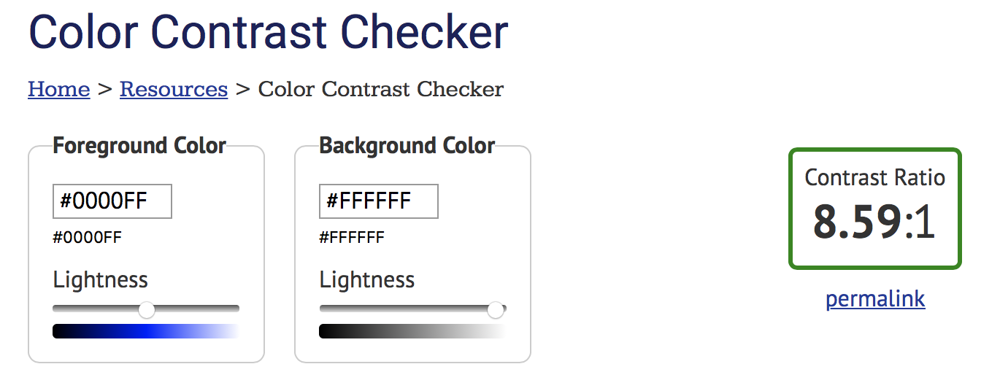

# Decodable

> Simple things should be simple, complex things should be possible. – *Alan Kay*

Hello, Swift developers. 

As programmers, we like to organize our stuff into classes and structs. And (especially as Swift programmers), we like our data to be strongly typed. However, our apps often have to talk to the rest of the world, usually file systems and "the cloud". In those contexts, data is "serialized", or transmogrified into an array of bytes. So we want tidy, reliable ways of turning structures into streams, and streams into structures. There are a number of frameworks that do this work. Two that Apple provides are `Codable` and `NSCoding`. Let's start with `Codable`, and perhaps we'll come back to `NSCoding` in a future episode.

<!--
One quick note before we go any further. You're probably familiar with syntax highlighting--where class names get one color and string literals another. That is **not** what's going on here. Instead, in these code examples, things which relate to `Codable` are orange and things which relate to `NSCoding` are blue. 
-->

Converting data structures into streams is called "serializing" or "encoding". If you want your structure to be transformed into `Data`, suitable for streaming, you will need to have your class, struct, or enum conform to `Encodable`.

Similarly, converting data back into a class, structure, or enum is called "deserializing" or "decoding". Your structure needs to conform to `Decodable` so that it can be reconstructed from `Data`.


Let's work with a concrete example. Perhaps you've gotten a mock-up from a designer that looks a little like this. It has some really prominent dark text for the title, and the subtitle is only a little smaller and slightly lighter gray. Then there's more text that's even smaller and even lighter. When I got a mock-up like this, I felt like I had to strain a bit to read it. So I worried that it might not be accessible to others. I'm not a designer, and I'm certainly not an accessibility expert, so I struggled with how to decide what was "enough" contrast, and how to help my designer agree with me.

It soothes my brain immensely to learn that there is a definition of "enough" contrast, backed by field research, the biology of how humans perceive light, and math! There's a single number to define the contrast between any two colors, and a grading scale for what numbers are good enough. Not only that, but there are websites for looking up these numbers, such as webaim.org, so we don't even have to do the math. 


Here's the contrast for black and [this particularly delightful shade of purple](https://gwendolyn.io/about/). This combination gets a triple-A rating when used for large text, but only a double-A rating for small text. These colors are fine together for titles, but it would be better to find a slightly higher contrast for paragraphs of text, if possible. 

So, that's a nice accessibility tip, but we were talking about serializing data. Well, this website is in the cloud, and it has an API. If you add `&api` to the URL, instead of a webpage, the site serves up some JSON containing the same information. 
```json
{
     "ratio": 5.04,
     "AA": "pass",
     "AALarge": "pass",
     "AAA": "fail",
     "AAALarge": "pass"
}
```

And if you squint at this JSON just a little, it starts to look like a Swift struct. 
```swift
struct WebColorContrastResponse {
  let ratio: CGFloat
  let AA: String
  let AALarge: String
  let AAA: String
  let AAALarge: String
}
```

We have some data and we want to convert it into our data structure. That means our struct should conform to `Decodable`. What does it look like to conform to `Decodable`? There's only a single method to conform. `init(from: Decoder)` We can implement this initializer, and in doing so, we find it's pretty handy to create a `CodingKey` enum for the keys of our data. 

```swift
struct WebColorContrastResponse: Decodable {
  init(from decoder: Decoder) throws {
    let values = try decoder.container(keyedBy: CodingKeys.self)
    ratio = try values.decode(CGFloat.self, forKey: .ratio)
    AA = try values.decode(String.self, forKey: .AA)
    AALarge = try values.decode(String.self, forKey: .AALarge)
    AAA = try values.decode(String.self, forKey: .AAA)
    AAALarge = try values.decode(String.self, forKey: .AAALarge)
  } 
  
  enum CodingKeys: String, CodingKey {
    case ratio = "ratio"
    case AA = "AA"
    case AALarge = "AALarge"
    case AAA = "AAALarge"
    case AAALarge = "AAALarge"
  }
  
  let ratio: CGFloat
  let AA: String
  let AALarge: String
  let AAA: String
  let AAALarge: String
}
```

This is doable, but a little tedious. We now have all our properties listed out in the initializer, and again in the `CodingKey` enum, so they're 3 times in this relatively short blob of code. I don't like that, you probably don't like that. Fortunately, the developers of `Codable` didn't like it either. We don't have to write all this. In many cases, the Swift compiler can generate all this code automatically. If every property in your struct is `Decodable`, just declare your struct `Decodable` and you're done. Or if your enum is backed by a `Decodable` type, you can get free conformance on the enum. Just say it conforms and you're done. 
```swift
struct WebColorContrastResponse: Decodable {
  let ratio: CGFloat
  let AA: String
  let AALarge: String
  let AAA: String
  let AAALarge: String
}
```

This is all fine if you have total control of the data format. But life isn't always so tidy. Maybe your data comes from a server that uses different naming conventions. Now your keys don't look like Swift property names, or might be confusing in the context of your code. If you just want to customize the keys, bring back that `CodingKeys` enum. List all your properties, and specify the string values for the ones you want to customize. 
```swift
struct WebColorContrastResponse: Decodable {
  enum CodingKeys: String, CodingKey {
    case ratio
    case smallDoubleA = "AA"
    case largeDoubleA = "AALarge"
    case smallTripleA = "AAA"
    case largeTripleA = "AAALarge"
  }

  let ratio: CGFloat
  let smallDoubleA: String
  let largeDoubleA: String
  let smallTripleA: String
  let largeTripleA: String
}
```

Sometimes that's not enough. Sometimes you need to do more custom handling. Maybe the types don't match. When I first looked at the JSON from [webaim.org](https://webaim.org/resources/contrastchecker/?fcolor=A157E8&bcolor=000000&api), the struct looked like this, and I wrote a whole Playground around fetching and processing this data. Then I came back to run my code a few months later, and it didn't work at all. After way too much frustration, I realized that they had changed the type of the `ratio` from a decimal number to a string! If you need to cast types or do other custom handling, you can bring back the explicit `init(from: Decoder`. Like any other initializer, all properties have to be initialized. If anything might go wrong, you can throw the same sort of `DecodingError` that would have been thrown by the compiler-generated initializer, or you can handle the failure case some other way that makes more sense for your situation. 

```swift
struct WebColorContrastResponse: Decodable {
  init(from decoder: Decoder) throws {
    let values = try decoder.container(keyedBy: CodingKeys.self)
    let str = try values.decode(String.self, forKey: .ratio)
    guard let ratioAsDouble = Double(str) else {
      throw DecodingError.typeMismatch(…)
    }
    ratio = CGFloat(ratioAsDouble)
    tripleA = try values.decode(String.self, forKey: .tripleA)
    // etc.
  }   

  enum CodingKeys: String, CodingKey {
    case ratio
    case tripleA = "AAA"
    // etc.
  }

  let ratio: CGFloat
  let tripleA: String
  // etc.
}
```

For JSON, there's even more ways to adapt `JSONDecoder` to the realities of your situation. If you've got dates to parse, you can configure the `JSONDecoder` to use one of the standardized strategies, or even define your own if you've got some really quirky dates to wrangle. If your data keys don't need full renaming, just converting from one naming convention to another, you may be able to use a `keyDecodingStrategy` to avoid having to create a full `CodingKeys` enum. 

Now, if I may, I'd like to offer a couple opinions on *Stylish* implementations of `Decodable`. Let's go back to the full struct, with custom key names and an explicit initializer to deal with the type mismatch. Even with only five properties, this is feeling pretty cumbersome. The first thing you can do to tidy this up is move the protocol conformance to an extension. This makes it really clear what parts of the code are the basic struct, and which ones are particularly for `Decodable`. Also, this moves the custom `init(from: Decoder)` out of the struct definition. When a struct has no explicit initializers in its definition, the compiler synthesizes a basic one that has a parameter for each property, in the order they're defined. With the `Decodable` initializer in the struct, that default one wasn't being generated. By moving the `Decodable` initializer to an extension, the default one will be synthesized again. 

```swift
struct WebColorContrastResponse {
  let ratio: CGFloat
  let tripleA: String
  // etc.
}

extension WebColorContrastResponse: Decodable {
  init(from decoder: Decoder) throws {
    let values = try decoder.container(keyedBy: CodingKeys.self)
    let str = try values.decode(String.self, forKey: .ratio)
    guard let ratioAsDouble = Double(str) else {
      throw DecodingError.typeMismatch(…)
    }
    ratio = CGFloat(ratioAsDouble)
    tripleA = try values.decode(String.self, forKey: .tripleA)
    // etc.
  }   

  enum CodingKeys: String, CodingKey {
    case ratio
    case tripleA = "AAA"
    // etc.
  }
}

let serverResponse = WebColorContrastResponse(from: someDecoder
let locallyAssembledResponse = WebColorContrastResponse(ratio: 2.6, tripleA: false, doubleA: false, tripleALarge: false, doubleALarge: false)
```

It might be worth going even one step further. Reduce the primary web response struct back down to its most basic form, with synthesized conformance to `Decodable`. Then create a separate data type which can be initialized from this web response struct. The web response provides a concise record of your code's contract with the service, and the new type can handle all the bridging from that web response. 

```swift
struct WebContrastResponse: Decodable {
  let ratio: String
  let AA: String
  let AALarge: String
  let AAA: String
  let AAALarge: String
}

struct ColorContrast {
  let ratio: CGFloat
  let smallTextRating: Rating
  let largeTextRating: Rating
}

extension ColorContrast {
  init?(webResponse: WebColorContrastResponse) {
    guard let ratioAsDouble = Double(webResponse.ratio) else { return nil }
    ratio = CGFloat(ratioAsDouble)
    smallTextRating = Rating(webResponse.AA, webResponse.AAA)
    largeTextRating = Rating(webResponse.AALarge, webResponse.AAALarge)
  }
} 

enum Rating {
  case doubleAPass
  case tripleAPass
  case fail

  init(_ doubleA: String, _ tripleA: String) {
    switch(doubleA, tripleA) {
      case ("pass", "pass"): return .tripleAPass
      case ("pass", "fail"): return .doubleAPass
      default: return .fail
    }
  }
}
```

So that's `Decodable`. `Encodable` is really similar, so I won't go into all the details again. However, I would like to call out one configuration option on `JSONEncoder`. With `.outputFormatting` you can specify `.sortedKeys`. Most JSON decoders—including Swift's `JSONDecoder`—won't care what order the keys are in. But it's very handy in automated tests to compare the JSON as a `String` or `Data` with some expected value. If the keys are not in a predictable order, such a test will fail. Even worse, it won't *always* fail, because sometimes the dictionary will be in the exact order your test specified. 

